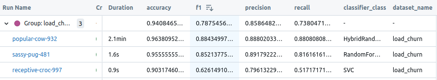
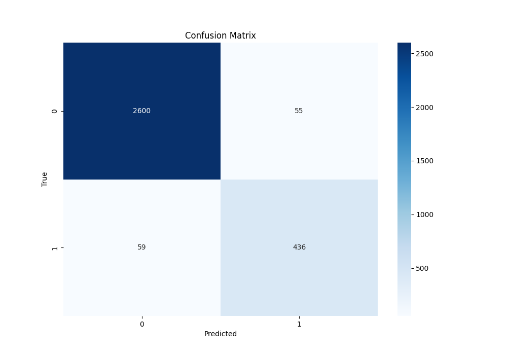

### Skuteczność hybrydowego modelu

Przeprowadziliśmy eksperyment, w którym porównaliśmy nasz hybrydowy las (nazywany dalej HybridRandomForest) z bazowym lasem losowym oraz modelem SVM z biblioteki scikit-learn (RandomForest). Modele z scikit-learn zostały stworzone z domyślnymi parametrami, natomiast nasz hybrydowy las został stworzony z hiperparametrami wyznaczonymi w poprzednim eksperymencie. Warto zaznaczyć, że trenowaliśmy oraz walidowaliśmy modele przy użyciu walidacji krzyżowej o stopniu 5, co oznacza, że wyniki są uśrednione.

#### Wyniki dla Telecom Churn

##### Porównanie metryk F1, Precyzja, Czułość i Dokładność
    

Wykres przedstawia wyniki dla czterech metryk dla trzech modeli.

###### Obserwacje
- **SVC**:
  - F1: ~0,63 (niskie).
  - Precyzja: ~0,79.
  - Czułość: ~0,52 (bardzo niskie).
  - Dokładność: ~0,90.
  - Pomimo przyzwoitej dokładności, niska czułość sugerują, że model ma problem z poprawnym rozpoznaniem klasy 1.
- **RandomForestClassifier**:
  - F1: ~0,85 (dobre).
  - Precyzja i Czułość: ~0,89 i ~0,82 (dobry balans).
  - Dokładność: ~0,96.
  - Wyniki wskazują na stabilny model o dobrej wydajności.
- **HybridRandomForest**:
  - F1: ~0,90 (najwyższe).
  - Precyzja i Czułość: ~0,89 i ~0,88 (bardzo dobry balans).
  - Dokładność: ~0,96.
  - Model osiąga najlepsze wyniki we wszystkich metrykach (oprócz minimalnie wyższej Precyzji dla RandomForestClassifier), co czyni go liderem na tym zbiorze.

##### Macierze pomyłek
###### HybridRandomForest

###### RandomForestClassifier

-1.png>)

###### SVM

.png>)

Wizualizacja macierzy pomyłek potwierdza wcześniejsze wnioski. Liderem pozostaje HybridRandomForest, który popełnia bardzo mało błędów.

##### Wnioski

W kontekście analizy churn (utrata klientów), **Czułość** jest szczególnie istotną metryką, ponieważ pozwala wykrywać jak najwięcej przypadków pozytywnych (np. klientów, którzy mogą odejść). HybridRandomForest osiągnął najlepszy wynik, co czyni go szczególnie użytecznym w tym zastosowaniu.

#### Wyniki dla Wine Quality

##### Porównanie metryk F1, Precyzja, Czułość i Dokładność

Wykres przedstawia wyniki dla czterech metryk dla trzech modeli.

###### Obserwacje
- **SVC**:
  - **F1**: ~0,82 .
  - **Precyzja**: ~0,76.
  - **Czułość**: ~0,87.
  - **Dokładność**: ~0,78.
  - Model charakteryzuje się wysokim poziomem czułości i niskimi innymi metrykami, co może sugerować, że model zazwyczaj przewiduje klasę 1.
- **RandomForestClassifier**:
  - **F1**: ~0,87.
  - **Precyzja**: ~0,86.
  - **Czułość**: ~0,89.
  - **Dokładność**: ~0,84.
  - Model prezentuje bardzo dobre wyniki we wszystkich metrykach, zwłaszcza dokładność.
- **HybridRandomForest**:
  - **F1**: ~0,85.
  - **Precyzja**: ~0,80.
  - **Czułość**: ~0,90.
  - **Accuracy**: ~0,80.

##### Macierze pomyłek
###### HybridRandomForest

.png>)

###### RandomForestClassifier

.png>)

###### SVM

.png>)

Wizualizacja macierzy pomyłek potwierdza wcześniejsze wnioski. Bazowy RandomForestClassifier zdecydowanie lepiej radzi sobie z klasą, której jest mniej.

##### Wnioski

RandomForestClassifier okazał się liderem na zbiorze Wine Quality. HybridRandomForest charakteryzuje się sensownymi wynikami, lecz ma tendencję do przewidywania klasy z większą ilością próbek.

#### Wyniki dla Iris

Wszystkie modele uzyskały perfekcyjne wyniki na tym zbiorze danych. Zbiór ten okazał się "zbyt prosty" dla wszystkich porównywanych modeli.

#### Wnioski z eksperymentu 

Podsumowując, HybridRandomForest okazał się najbardziej efektywnym modelem w analizie churn, natomiast RandomForestClassifier był liderem na zbiorze Wine Quality. SVM nie sprawdził się dobrze w żadnym z zadań. Istotną uwagą jest to że nasz autorski HybridRandomForest jest wielokrotnie wolnijeszy od modeli z scikit-learn.