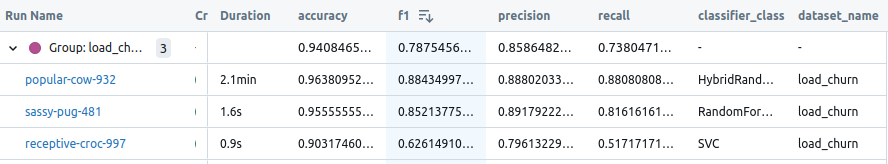
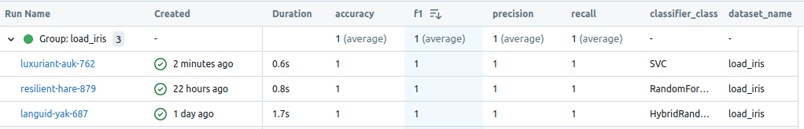

# Autorzy
Mateusz Ostaszewski 325203  
Michał Sadowski 325221

# Zadanie
Połączenie lasu losowego z SVM w zadaniu klasyfikacji. Postępujemy tak jak przy tworzeniu lasu losowego, tylko co drugi klasyfikator w lesie to SVM. Jeden z klasyfikatorów (SVM lub drzewo ID3) może pochodzić z istniejącej implementacji.

# Interpretacja i doprecyzowanie treści zadania
Celem zadania jest stworzenie hybrydowego modelu klasyfikatora, który łączy drzewa ID3 i maszyny wektorów nośnych (SVM).

## Algorytmy
1. Drzewo decyzyjne (ID3): Zaimplementujemy algorytm ID3 do budowy drzew decyzyjnych, który wybiera podział w węźle na podstawie maksymalizacji zysku informacyjnego (information gain).
2. SVM (Support Vector Machine): Będziemy korzystać z dostepnej implemenacji SVM z biblioteki [scikit-learn](https://scikit-learn.org/1.5/modules/svm.html).

## Integracja w modelu hybrydowym:

- Dla każdego klasyfikatora generujemy losowy podzbiór danych treningowych.
- Co drugi klasyfikator jest zastępowany SVM.
Wynik końcowy jest określany na podstawie głosowania większościowego.

# Metryki
-   $$
    \text{Dokładność} = \frac{\text{TP} + \text{TN}}{\text{TP} + \text{TN} + \text{FP} + \text{FN}}
    $$
-   $$  
    \text{F1} = 2 \cdot \frac{\text{Precyzja} \cdot \text{Czułość}}{\text{Precyzja} + \text{Czułość}}
    $$
-   $$
    \text{Precyzja} = \frac{\text{TP}}{\text{TP} + \text{FP}}
    $$
-   $$
    \text{Czułość} = \frac{\text{TP}}{\text{TP} + \text{FN}}
    $$
-   
    

    Macierz pomyłek
    

# Zbiory danych
## 1. [Iris](https://archive.ics.uci.edu/dataset/53/iris)
- Liczba przykładów: 150
- Liczba klas: 3 - sprowadzone do 2(dla SVM)
- Liczba cech: 4 (długość/szerokość kielicha i płatka)

## 2. [Wine Quality](https://archive.ics.uci.edu/dataset/186/wine+quality)
- Liczba przykładów: 4898 (wino białe), 1599 (wino czerwone)
- Liczba klas: od 0 do 10 – oceny jakości wina (przyjmujemy od 0 do 5 za wina słabe, a powyżej za wina dobre)
- Liczba cech: 11 (chemiczne właściwości)

## 3. [Telecom Churn](https://archive.ics.uci.edu/dataset/563/iranian+churn+dataset)
- Liczba przykładów: 3150
- Liczba klas: 2 (churn lub nie churn)
- Liczba cech: 21 (informacje o klientach, użycie usług).

# Zmiany względem dokumentacji wstepnej
Podjęliśmy decyzję o sprowadzeniu klasyfikacji wieloklasowej w zbiorach Iris oraz Wine Quality do klasyfikacji binarnej. W przypadku zbioru Iris uznaliśmy klasę Iris-setosa za 1, a pozostałe klasy za 0. W zbiorze Wine Quality uznaliśmy wina o ocenie 1-5 za wina słabe (klasa 0), a wina o ocenie 6-10 za wina dobre (klasa 1). Decyzje te były motywowane binarnymi właściwościami klasyfikatora SVM. Rozważaliśmy opcję pozostania przy pierwotnym rozkładzie klas, ale spowodowałoby to konieczność budowania drzew SVM (1 vs reszta), co uznaliśmy za niezgodne z poleceniem.

Dodatkowo, po konsultacjach, użyliśmy biblioteki Optuna do optymalizacji hiperparametrów naszego klasyfikatora.

# Eksperymenty numeryczne
**Walidacja modeli została przeprowadzona za pomocą walidacji krzyżowej z podziałem na 5 podzbiorów.**

## Wpływ parametrów modelu na skuteczność

TODO

## Skuteczność hybrydowego modelu

Przeprowadziliśmy eksperyment, w którym porównaliśmy nasz hybrydowy las (nazywany dalej HybridRandomForest) z bazowym lasem losowym oraz modelem SVM z biblioteki scikit-learn (RandomForest). Modele z scikit-learn zostały stworzone z domyślnymi parametrami, natomiast nasz hybrydowy las został stworzony z hiperparametrami wyznaczonymi w poprzednim eksperymencie. Warto zaznaczyć, że trenowaliśmy oraz walidowaliśmy modele przy użyciu walidacji krzyżowej o stopniu 5, co oznacza, że wyniki są uśrednione.

### Wyniki dla Telecom Churn

**Porównanie metryk F1, Precyzja, Czułość i Dokładność**
    

Wykres przedstawia wyniki dla czterech metryk dla trzech modeli.

**Obserwacje**

- **SVC**:
  - F1: ~0,63 (niskie).
  - Precyzja: ~0,79.
  - Czułość: ~0,52 (bardzo niskie).
  - Dokładność: ~0,90.
  - Pomimo przyzwoitej dokładności, niska czułość sugerują, że model ma problem z poprawnym rozpoznaniem klasy 1.
  
- **RandomForestClassifier**:
  - F1: ~0,85 (dobre).
  - Precyzja i Czułość: ~0,89 i ~0,82 (dobry balans).
  - Dokładność: ~0,96.
  - Wyniki wskazują na stabilny model o dobrej wydajności.
  
- **HybridRandomForest**:
  - F1: ~0,90 (najwyższe).
  - Precyzja i Czułość: ~0,89 i ~0,88 (bardzo dobry balans).
  - Dokładność: ~0,96.
  - Model osiąga najlepsze wyniki we wszystkich metrykach (oprócz minimalnie wyższej Precyzji dla RandomForestClassifier), co czyni go liderem na tym zbiorze.

**Macierze pomyłek**

**HybridRandomForest** 

-1.png>) 
**RandomForestClassifier**

.png>) 
**SVC**

Wizualizacja macierzy pomyłek potwierdza wcześniejsze wnioski. Liderem pozostaje HybridRandomForest, który popełnia bardzo mało błędów.

**Wnioski**

W kontekście analizy churn (utrata klientów), **Czułość** jest szczególnie istotną metryką, ponieważ pozwala wykrywać jak najwięcej przypadków pozytywnych (np. klientów, którzy mogą odejść). HybridRandomForest osiągnął najlepszy wynik, co czyni go szczególnie użytecznym w tym zastosowaniu.

### Wyniki dla Wine Quality

**Porównanie metryk F1, Precyzja, Czułość i Dokładność**

**Obserwacje**

- **SVC**:
  - **F1**: ~0,82 .
  - **Precyzja**: ~0,76.
  - **Czułość**: ~0,87.
  - **Dokładność**: ~0,78.
  - Model charakteryzuje się wysokim poziomem czułości i niskimi innymi metrykami, co może sugerować, że model zazwyczaj przewiduje klasę 1.

- **RandomForestClassifier**:
  - **F1**: ~0,87.
  - **Precyzja**: ~0,86.
  - **Czułość**: ~0,89.
  - **Dokładność**: ~0,84.
  - Model prezentuje bardzo dobre wyniki we wszystkich metrykach, zwłaszcza dokładność.
  
- **HybridRandomForest**:
  - **F1**: ~0,85.
  - **Precyzja**: ~0,80.
  - **Czułość**: ~0,90.
  - **Accuracy**: ~0,80.

**Macierze pomyłek**

.png>)
**HybridRandomForest** 

.png>)
**RandomForestClassifier**

.png>)
**SVC**

Wizualizacja macierzy pomyłek potwierdza wcześniejsze wnioski. Bazowy RandomForestClassifier zdecydowanie lepiej radzi sobie z klasą, której jest mniej.

**Wnioski**

RandomForestClassifier okazał się liderem na zbiorze Wine Quality. HybridRandomForest charakteryzuje się sensownymi wynikami, lecz ma tendencję do przewidywania klasy z większą ilością próbek.

### Wyniki dla Iris   

Wszystkie modele uzyskały perfekcyjne wyniki na tym zbiorze danych. Zbiór ten okazał się "zbyt prosty" dla wszystkich porównywanych modeli.

#### Wnioski z eksperymentu 

Podsumowując, HybridRandomForest okazał się najbardziej efektywnym modelem w analizie churn, natomiast RandomForestClassifier był liderem na zbiorze Wine Quality. SVM nie sprawdził się dobrze w żadnym z zadań. Istotną uwagą jest to że nasz autorski HybridRandomForest jest wielokrotnie wolnijeszy od modeli z scikit-learn.

# Wnioski 
TODO
