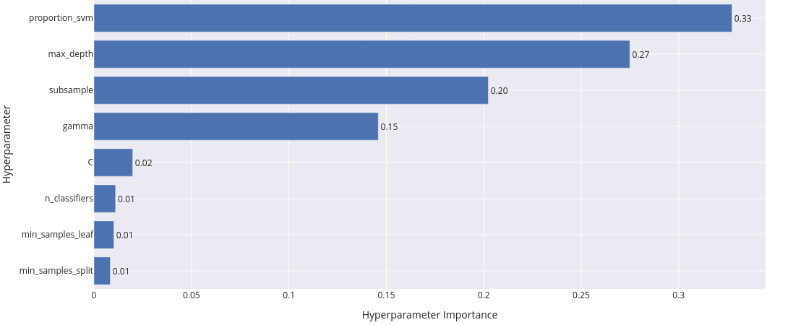

# Autorzy
Mateusz Ostaszewski 325203  
Michał Sadowski 325221

# Zadanie
Połączenie lasu losowego z SVM w zadaniu klasyfikacji. Postępujemy tak jak przy tworzeniu lasu losowego, tylko co drugi klasyfikator w lesie to SVM. Jeden z klasyfikatorów (SVM lub drzewo ID3) może pochodzić z istniejącej implementacji.

# Interpretacja i doprecyzowanie treści zadania
Celem zadania jest stworzenie hybrydowego modelu klasyfikatora, który łączy drzewa ID3 i maszyny wektorów nośnych (SVM).

## Algorytmy
1. Drzewo decyzyjne (ID3): Zaimplementujemy algorytm ID3 do budowy drzew decyzyjnych, który wybiera podział w węźle na podstawie maksymalizacji zysku informacyjnego (information gain).
2. SVM (Support Vector Machine): Będziemy korzystać z dostepnej implemenacji SVM z biblioteki [scikit-learn](https://scikit-learn.org/1.5/modules/svm.html).

## Integracja w modelu hybrydowym:

- Dla każdego klasyfikatora generujemy losowy podzbiór danych treningowych.
- Co drugi klasyfikator jest zastępowany SVM.
Wynik końcowy jest określany na podstawie głosowania większościowego.

# Metryki
-   $$
    \text{Dokładność} = \frac{\text{TP} + \text{TN}}{\text{TP} + \text{TN} + \text{FP} + \text{FN}}
    $$
-   $$  
    \text{F1} = 2 \cdot \frac{\text{Precyzja} \cdot \text{Czułość}}{\text{Precyzja} + \text{Czułość}}
    $$
-   $$
    \text{Precyzja} = \frac{\text{TP}}{\text{TP} + \text{FP}}
    $$
-   $$
    \text{Czułość} = \frac{\text{TP}}{\text{TP} + \text{FN}}
    $$
-   
    

    Macierz pomyłek
    

# Zbiory danych
## 1. [Iris](https://archive.ics.uci.edu/dataset/53/iris)
- Liczba przykładów: 150
- Liczba klas: 3 - sprowadzone do 2(dla SVM)
- Liczba cech: 4 (długość/szerokość kielicha i płatka)

## 2. [Wine Quality](https://archive.ics.uci.edu/dataset/186/wine+quality)
- Liczba przykładów: 4898 (wino białe), 1599 (wino czerwone)
- Liczba klas: od 0 do 10 – oceny jakości wina (przyjmujemy od 0 do 5 za wina słabe, a powyżej za wina dobre)
- Liczba cech: 11 (chemiczne właściwości)

## 3. [Telecom Churn](https://archive.ics.uci.edu/dataset/563/iranian+churn+dataset)
- Liczba przykładów: 3150
- Liczba klas: 2 (churn lub nie churn)
- Liczba cech: 21 (informacje o klientach, użycie usług).

# Zmiany względem dokumentacji wstepnej
Podjęliśmy decyzję o sprowadzeniu klasyfikacji wieloklasowej w zbiorach Iris oraz Wine Quality do klasyfikacji binarnej. W przypadku zbioru Iris uznaliśmy klasę Iris-setosa za 1, a pozostałe klasy za 0. W zbiorze Wine Quality uznaliśmy wina o ocenie 1-5 za wina słabe (klasa 0), a wina o ocenie 6-10 za wina dobre (klasa 1). Decyzje te były motywowane binarnymi właściwościami klasyfikatora SVM. Rozważaliśmy opcję pozostania przy pierwotnym rozkładzie klas, ale spowodowałoby to konieczność budowania drzew SVM (1 vs reszta), co uznaliśmy za niezgodne z poleceniem.

Dodatkowo, po konsultacjach, użyliśmy biblioteki Optuna do optymalizacji hiperparametrów naszego klasyfikatora.

# Eksperymenty numeryczne

**Walidacja modeli została przeprowadzona za pomocą walidacji krzyżowej z podziałem na 5 podzbiorów.**

### Analiza proporcji SVM w lesie losowym

Przeprowadziliśmy eksperyment w którym testujemy różne proporcje SVM w lesie aby sprawdzić w jaki sposób wpływa ona na skuteczność tego modelu.

#### Wyniki dla zbioru Wine Quality

  Poniższy wykres przedstawia wpływ hiperparametru określającego proporcję SVM w lesie na miarę F1 w wynikach modeli na zbiorze Wine Quality

#### Wyniki dla zbioru Telecom Churn

  Poniższy wykres przedstawia wpływ hiperparametru określającego proporcję SVM w lesie na miarę F1 w wynikach modeli na zbiorze Telecom Churnty

#### Wnioski z eksperymentu

1. Wpływ proporcji SVM na jakość modelu: 
  - W obu przypadkach (Wine Quality i Churn) obserwujemy, że większy udział SVM w modelu prowadzi do spadku jakości modelu. Miara F1 osiąga wyższe wartości przy niższych proporcjach SVM.

2. Hipoteza przyczyn spadku jakości:
  - SVM jest algorytmem bardziej wymagającym pod względem dostrajania hiperparametrów w porównaniu do drzew decyzyjnych. Domyślne hiperparametry użyte w tym eksperymencie (oferowane przez bibliotekę scikit-learn) mogą nie być odpowiednie dla danych na których przeprowadzamy eksperyment, co skutkuje gorszymi wynikami lasów z większą ilością SVM niż tych z większą ilością drzew. W kolejnych eksperymentach przetestujemy wpływ wszystkich hiperparametrów na jakość modelu co pozwoli nam dokładniej zbadać wpływ hiperparametrów w tym proporcji SVM na jakość modelu. 

### Wpływ parametrów modelu na skuteczność

Przeprowadziliśmy 4 eksperymenty dla różnych zbiorów danych. Zdecydowaliśmy się na przeprowadzenie tych eksperymentów przy pomocy Optuny, aby w efektywny sposób znaleźć optymalny zbiór hiperparametrów. Eksperymenty są podzielone na te przeprowadzone na pojedyńczych zbiorach, gdzie za każdym razem wyznaczaliśmy nowe hiperparametry oraz eksperyment w którym jeden zestaw hiperparametrów był testowany dla wszystkich zbiorów w celu wyznaczenia najbardziej ogólnego zestawu hiperparametrów.

#### Eksperymenty wyznaczające wartości hiperparametrów
- Na zbiorze Iris
- Na zbiorze Churn
- Na zbiorze Wine Quality
- Na wszystkich zbiorach naraz

---

#### Ważność hiperparametrów:

- Iris

- Churn

- Wine Quality

- Wszystkie

Możemy zauważyć, że we wszystkich zbiorach oprócz Iris dominowały hiperparametry związane z SVM. 
Ze zbiorem Iris, jako że jest mały oraz niezbyt skomplikowany dobrze radzi sobie większość klasyfikatorów nawet tych prostych.
Watro też zauważyć, że we wszystkich zbiorach proporcja svm:id3 była na korzyść SVM co także może tłumaczyć, dlaczego hiperparametry dotyczące SVM (C oraz gamma) były ważniejsze. 
We wszystkich zbiorach istotnym hiperparametrem był subsample co może nam mówić, że dla modeli ważne było selekcjonowanie danych, co przeciwdziałało w przeuczaniu się naszego klasyfikatora.

#### Analiza zależności między parametrami

#### Analiza wpływu hiperparametrów na wynik funkcji celu (Parallel Coordinate Plot)

#### **1. Kluczowe hiperparametry**
- **`C` (regularyzacja SVM)**:
  - Optymalny zakres: **10–100**.
  - Małe wartości `C` (<1) prowadzą do gorszych wyników.

- **`gamma` (parametr jądra RBF w SVM)**:
  - Optymalny zakres: **0,05–1**.
  - Ekstremalne wartości `gamma` (bardzo małe <0,001 lub bardzo duże >1) pogarszają wyniki.

- **`proportion_svm` (udział SVM w hybrydzie)**:
  - Wyższe wartości `proportion_svm` (>0,5) dominują w najlepszych wynikach.
  - Niskie wartości (<0,3) prowadzą do słabych wyników.

- **`subsample` (próbkowanie danych)**:
  - Najlepsze wyniki przy pełnym próbkowaniu (`subsample` około 1).
  - Niskie wartości subsample (<0,5) osłabiają wydajność.

---

#### **2. Najważniejsze zależności między hiperparametrami**
- **`C` i `gamma`**:
  - Kombinacja **`C`** w zakresie **10–100** i **`gamma`** w zakresie **0,05–1** prowadzi do najlepszych wyników.

---

#### **3. Podsumowanie wniosków**
- **Kluczowe hiperparametry**:
  - `C`: **10–100**
  - `gamma`: **0,05–1**
  - `proportion_svm`: **>0,5**
  - `subsample`: około **1.0**

- **Mniej istotne hiperparametry**:
  - `min_samples_leaf` i `min_samples_split` mają niewielki wpływ na wyniki.

- **Dominacja SVM**:
  - Wyższy udział SVM w hybrydzie znacząco poprawia wyniki, zwłaszcza w złożonych zbiorach danych.

---

**Kluczowy wniosek**: Optymalne wyniki osiągane są przy umiarkowanej regularyzacji `C`, małych wartościach `gamma`, większej liczbie klasyfikatorów oraz wysokim udziale SVM w hybrydowym modelu.

#### Analiza zależności między parametrami

##### **1. `C` i `gamma`**

Poniższy wykres przedstawia relację między hiperparametrami `C` oraz `gamma`, oraz ich wpływ na wyniki modelu. 

- **Obszar najlepszych wyników**:
  - Najlepsze wartości funkcji celu koncentrują się dla średnich i dużych wartości `C` (10–100) oraz małych wartości `gamma` (0,05–1).
  - Kombinacja dużej regularyzacji `C` i umiarkowanego wygładzenia jądra RBF daje stabilne, wysokie wyniki.
- **Obszar słabych wyników**:
  - Bardzo małe wartości `C` (< 1) oraz ekstremalne wartości `gamma` (bardzo małe < 0,0001 lub duże > 1) prowadzą do gorszych wyników.
- **Wniosek**:
  - Optymalizacja `C` i `gamma` jest kluczowa, przy czym należy preferować:
    - **C**: 10–100
    - **gamma**: 0,001–0,01

---

##### **2. `n_classifiers` i `proportion_svm`**

Poniższy wykres przedstawia relację między hiperparametrami `n_classifiers` oraz `proportion_svm`, oraz ich wpływ na wyniki modelu. 

- **Obszar najlepszych wyników**:
  - Najlepsze wyniki (czerwone punkty) są uzyskiwane dla:
    - Liczby klasyfikatorów nieuciekającej w skrajności (50 < `n_classifiers` < 150).
    - Średnich i wyższych wartości `proportion_svm` (0,5–0,7).
- **Obszar słabych wyników**:
  - Dla skrajnycj ilości klasyfikatorów (n_classifiers < 50 lub n_classifiers > 150), niezależnie od proporcji SVM, wyniki są słabe.
  - Dla niskiej proporcji svm (< 40), niezależnie od liczby klasyfiaktorów wyniki są słabe.
- **Wniosek**:
  - Zrównoważona ilość klasyfiaktorów oraz większy udział SVM (powyżej 0,5) znacząco poprawiają wyniki.

---

##### **3. `n_classifiers` i `subsample`**

Poniższy wykres przedstawia relację między hiperparametrami `n_classifiers` oraz `subsample`, oraz ich wpływ na wyniki modelu. 

- **Obszar najlepszych wyników**:
  - Najlepsze wyniki występują przy:
    - Pełnym podpróbowaniu danych (`subsample` > 0,8).
    - Nie za dużej (`n_classifiers` < 150).
- **Obszar słabych wyników**:
  - Małe wartości `subsample` (< 0,5) prowadzą do pogorszenia wyników, nawet przy dużej liczbie klasyfikatorów.
- **Wniosek**:
  - Pełne wykorzystanie danych (brak próbkowania) prowadzi do lepszych wyników.

---

##### **4. `C` i `proportion_svm`**

Poniższy wykres przedstawia relację między hiperparametrami `C` oraz `proportion_svm`, oraz ich wpływ na wyniki modelu.

- **Obszar najlepszych wyników**:
  - Optymalne wyniki pojawiają się dla:
    - Średnich i dużych wartości `C` (10–100).
    - Proporcji SVM z przedziału (0,4 < `proportion_svm` < 0,6).
- **Obszar słabych wyników**:
  - Małe wartości `C` (< 5) oraz niski udział SVM (< 0,4) prowadzą do najgorszych wyników.
- **Wniosek**:
  - Kombinacja dużego `C` i wyższego udziału SVM wzmacnia wydajność modelu hybrydowego.

---

#### Najlepsze wyniki:

Poniższa tabela przedstawia metryki uzyskane poprzez najlepsze modele dla eksperymentu dla osobno dobieranych hiperparametrów dla każdego zbioru danych:

| Zbiór danych | F1 | Dokładność | Czułość | Precyzja | 
| ------------ | -- | ---------- | ------- | -------- |  
| Iris         | 1  |       1    |    1    |      1   |
| Churn        |0,89|     0,97   |   0,89  |     0,9  |
| Wine         |0,85|     0,8    |  0,9    |   0,81   |

Poniższa tabela przedstawia metryki uzyskane poprzez najlepsze modele dla eksperymentu dla jednokowo dobieranych hiperparametrów dla każdego zbioru danych:

| Zbiór danych | F1 | Dokładność | Czułość | Precyzja | 
| ------------ | -- | ---------- | ------- | -------- |  
| Iris         | 1  |       1    |    1    |      1   |
| Churn        |0,89|     0,97   |   0,88  |     0,9  |
| Wine         |0,84|     0,8    |  0,86   |   0,83   |

##### Macierze Pomyłek

- Iris

- Churn

- Wine

---

- Iris

- Churn

- Wine

---

#### Wnioski z macierzy pomyłek

- W przypadku **prostych zbiorów** (Iris) dostrajanie hiperparametrów **nie jest konieczne** – model działa idealnie.

- Dla bardziej **złożonych zbiorów** (Churn, Wine Quality):
  - Dostrajanie hiperparametrów dla każdego zbioru osobno poprawia wyniki.
  - Wspólne parametry nie są optymalne, prowadząc do **większej liczby błędów klasyfikacji**.

##### Główne Wnioski

- **Iris**:
  - Zbiór jest prosty, więc model osiąga perfekcyjne wyniki zarówno przy wspólnych, jak i różnych parametrach.

- **Churn**:
  - Dostosowanie parametrów poprawia wyniki nieznacznie, ale warto to robić, ponieważ zbiór jest bardziej wymagający (większy `SVM proportion` i dostosowane `C`).

- **WineQuality**:
  - Model osiąga gorsze wyniki przy wspólnych parametrach.
  - Warto dostosowywać parametry indywidualnie dla tego zbioru.

- **Optymalizacja SVM proportion**:
  - W tym eksperymentcie możemy zauważyć, że w przeciwieństiwe do 1 eksperymentu w którym był badany wpływ % SVM, większa proporcja SVM wpływa pozytywnie na jakość modelu. Jest to prawdopodobnie spowodowane lepszym doborem hiperparametrów dotyczących SVM takich jak (C oraz gamma).
  - Zbiory bardziej złożone (jak **Churn**) wymagają większego udziału SVM.
  - Zbiory prostsze (jak **Iris**) mogą działać dobrze z mniejszym udziałem SVM.

- **Dostosowanie hiperparametrów**:
  - Ogólne ustawienia parametrów są wystarczające dla prostszych zbiorów, ale dla trudniejszych (**Churn**, **WineQuality**) indywidualne dostrajanie przynosi minimalne, korzyści.

## Skuteczność hybrydowego modelu

Przeprowadziliśmy eksperyment, w którym porównaliśmy nasz hybrydowy las (nazywany dalej HybridRandomForest) z bazowym lasem losowym oraz modelem SVM z biblioteki scikit-learn (RandomForest). Modele z scikit-learn zostały stworzone z domyślnymi parametrami, natomiast nasz hybrydowy las został stworzony z hiperparametrami wyznaczonymi w poprzednim eksperymencie. Warto zaznaczyć, że trenowaliśmy oraz walidowaliśmy modele przy użyciu walidacji krzyżowej o stopniu 5, co oznacza, że wyniki są uśrednione.

### Wyniki dla Telecom Churn
Poniższa table przedstawia wyniki modeli na zbiorze Telecom Churn

| Model              | Czas    | Dokładność | F1   | Precyzja | Czułość |
|---------------------|---------|------------|------|----------|---------|
| HybridRandomForest | 2,1 min | 0,96       | 0,88 | 0,89     | 0,88    |
| RandomForest       | 1,6 s   | 0,96       | 0,85 | 0,89     | 0,82    |
| SVC                | 0,9 s   | 0,90       | 0,63 | 0,80     | 0,52    |

**Porównanie metryk F1, Precyzja, Czułość i Dokładność**
    

Wykres przedstawia wyniki dla czterech metryk dla trzech modeli.

**Obserwacje**

- **SVC**:
  - F1: ~0,63 (niskie).
  - Precyzja: ~0,79.
  - Czułość: ~0,52 (bardzo niskie).
  - Dokładność: ~0,90.
  - Pomimo przyzwoitej dokładności, niska czułość sugerują, że model ma problem z poprawnym rozpoznaniem klasy 1.
  
- **RandomForestClassifier**:
  - F1: ~0,85 (dobre).
  - Precyzja i Czułość: ~0,89 i ~0,82 (dobry balans).
  - Dokładność: ~0,96.
  - Wyniki wskazują na stabilny model o dobrej wydajności.
  
- **HybridRandomForest**:
  - F1: ~0,90 (najwyższe).
  - Precyzja i Czułość: ~0,89 i ~0,88 (bardzo dobry balans).
  - Dokładność: ~0,96.
  - Model osiąga najlepsze wyniki we wszystkich metrykach (oprócz minimalnie wyższej Precyzji dla RandomForestClassifier), co czyni go liderem na tym zbiorze.

**Macierze pomyłek**

**HybridRandomForest** 

-1.png>) 
**RandomForestClassifier**

.png>) 
**SVC**

Wizualizacja macierzy pomyłek potwierdza wcześniejsze wnioski. Liderem pozostaje HybridRandomForest, który popełnia bardzo mało błędów.

**Wnioski**

W kontekście analizy churn (utrata klientów), **Czułość** jest szczególnie istotną metryką, ponieważ pozwala wykrywać jak najwięcej przypadków pozytywnych (np. klientów, którzy mogą odejść). HybridRandomForest osiągnął najlepszy wynik, co czyni go szczególnie użytecznym w tym zastosowaniu.

### Wyniki dla Wine Quality

Poniższa table przedstawia wyniki modeli na zbiorze Wine Quality.
| Model              | Czas     | Dokładność | F1   | Precyzja | Czułość |
|---------------------|----------|------------|------|----------|---------|
| HybridRandomForest | 13,3 min | 0,80       | 0,85 | 0,81     | 0,90    |
| RandomForest       | 4,3 s    | 0,84       | 0,87 | 0,86     | 0,89    |
| SVC                | 4,0 s    | 0,76       | 0,82 | 0,78     | 0,87    |

**Porównanie metryk F1, Precyzja, Czułość i Dokładność**

**Obserwacje**

- **SVC**:
  - **F1**: ~0,82 .
  - **Precyzja**: ~0,76.
  - **Czułość**: ~0,87.
  - **Dokładność**: ~0,78.
  - Model charakteryzuje się wysokim poziomem czułości i niskimi innymi metrykami, co może sugerować, że model zazwyczaj przewiduje klasę 1.

- **RandomForestClassifier**:
  - **F1**: ~0,87.
  - **Precyzja**: ~0,86.
  - **Czułość**: ~0,89.
  - **Dokładność**: ~0,84.
  - Model prezentuje bardzo dobre wyniki we wszystkich metrykach, zwłaszcza dokładność.
  
- **HybridRandomForest**:
  - **F1**: ~0,85.
  - **Precyzja**: ~0,80.
  - **Czułość**: ~0,90.
  - **Accuracy**: ~0,80.

**Macierze pomyłek**

.png>)
**HybridRandomForest** 

.png>)
**RandomForestClassifier**

.png>)
**SVC**

Wizualizacja macierzy pomyłek potwierdza wcześniejsze wnioski. Bazowy RandomForestClassifier zdecydowanie lepiej radzi sobie z klasą, której jest mniej.

**Wnioski**

RandomForestClassifier okazał się liderem na zbiorze Wine Quality. HybridRandomForest charakteryzuje się sensownymi wynikami, lecz ma tendencję do przewidywania klasy z większą ilością próbek.

### Wyniki dla Iris   

| Model              | Czas    | Dokładność | F1   | Precyzja | Czułość |
|---------------------|---------|------------|------|----------|---------|
| HybridRandomForest | 1,7 s   | 1,00       | 1,00 | 1,00     | 1,00    |
| RandomForest       | 0,8 s   | 1,00       | 1,00 | 1,00     | 1,00    |
| SVC                | 0,6 s   | 1,00       | 1,00 | 1,00     | 1,00    |

Wszystkie modele uzyskały perfekcyjne wyniki na tym zbiorze danych. Zbiór ten okazał się "zbyt prosty" dla wszystkich porównywanych modeli.

#### Wnioski z eksperymentu 

Podsumowując, HybridRandomForest okazał się najbardziej efektywnym modelem w analizie churn, natomiast RandomForestClassifier był liderem na zbiorze Wine Quality. SVM nie sprawdził się dobrze w żadnym z zadań. Istotną uwagą jest to że nasz autorski HybridRandomForest jest wielokrotnie wolnijeszy od modeli z scikit-learn.

# Wnioski z projektu
Las losowy z SVM jest zdecydowanie lepszy od pojedyńczego SVM. W porownaniu z standardowym lasem losowym wypada porownywalnie, ma lesze wyniki na czułości. Zdecydowanym minusem naszego modelu jest jego czas uczenia oraz inferencji, ktory jest wielokrotnie większy.

Według wyników przeprowadzonych eksperymentów, lasy które zawierały wysoką proporcję SVM dawały lepsze wyniki niż te z mnieszą. Jednak warunkiem do tak otrzymanych wyników jest odpowiednie dobranie hiperparametrów SVM.

Z tego wynika, że najważnieszymi hiperparametrami były te dotyczące SVM (C oraz gamma). Hiperparametrem który także mocno wpływał na skuteność modelu był subsample, który odpowiadał za to aby model się nie przeuczał. 